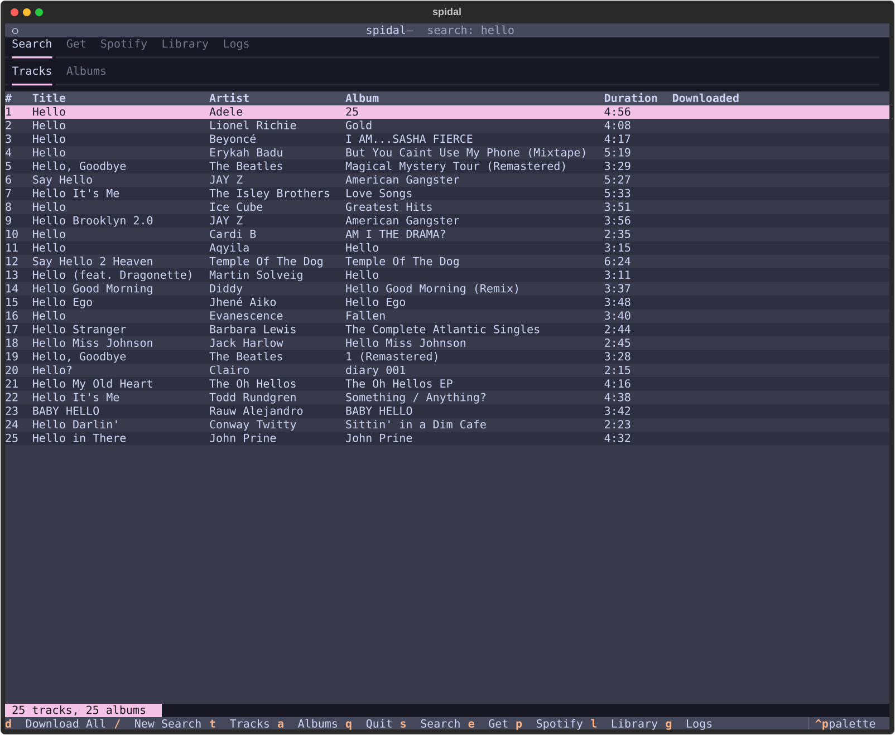

# spidal

FLAC downloader with a terminal UI and CLI. Searches the Monochrome API, matches via Spotify ISRC, and tags downloaded files with MusicBrainz metadata.

## Install

Requires Python 3.12+

```bash
pip install spidal
```

or run it with [uv](https://docs.astral.sh/uv/).

```bash
uvx spidal
```

## TUI



Launch the interactive interface:

```bash
spidal
```

### Tabs

| Key | Tab     | Description                                         |
|-----|---------|-----------------------------------------------------|
| `s` | Search  | Search the Monochrome API for tracks and albums     |
| `e` | Get     | Paste up to 25 URLs and bulk download               |
| `p` | Spotify | Browse and download your Spotify playlists from Monochrome |
| `l` | Library | View downloaded tracks, no-match records, failures  |
| `g` | Logs    | View the application log                            |

Press `q` to quit.

### Search tab

| Key | Action               |
|-----|----------------------|
| `/` | New search           |
| `d` | Download all results |
| `t` | Switch to Tracks tab |
| `a` | Switch to Albums tab |

Press Enter on a track or album to download it, open it in a browser, or open its location on disk.

> **Note:** Search results are limited to 25 items — this is a limitation of the upstream API.

### Get tab

Paste up to 25 Monochrome or Spotify URLs (one per field) and press **Download All** or `Ctrl+D`. Supported URL types:

- `https://monochrome.tf/track/<id>`
- `https://monochrome.tf/album/<id>`
- `https://open.spotify.com/track/<id>`
- `https://open.spotify.com/album/<id>`
- `https://open.spotify.com/playlist/<id>`

Press `Esc` while typing in a field to return to hotkey navigation.

### Spotify tab

On first use, you will be prompted to enter a Spotify access token:

1. Press **Open Spotify Developer Console** to open [developer.spotify.com](https://developer.spotify.com) in your browser, log in, and copy the token from the example code
2. Paste the token into the input field and press Enter

Once authenticated, your playlists are listed. Press Enter on a playlist to download it or open it in your browser.

| Key   | Action               |
|-------|----------------------|
| `a`   | Enter / update token |
| `r`   | Reload playlists     |
| `Esc` | Dismiss token prompt |

### Library tab

Three sub-tabs showing track records from the database. Press Enter on any row to open an action menu.

| Key | Sub-tab    | Description                                | Enter action          |
|-----|------------|--------------------------------------------|-----------------------|
| `d` | Downloaded | Successfully downloaded tracks             | Open file location    |
| `n` | No Match   | Spotify tracks with no Monochrome match    | Reprocess (re-match)  |
| `f` | Failed     | Tracks that matched but failed to download | Reprocess (re-download) |

| Key | Action |
|-----|--------|
| `r` | Reload |

### Logs tab

| Key    | Action           |
|--------|------------------|
| `r`    | Reload           |
| `Home` | Scroll to top    |
| `End`  | Scroll to bottom |

## CLI commands

### `spidal get <url>`

Download a track, album, playlist, or liked songs by URL.

```bash
spidal get https://open.spotify.com/track/...
spidal get https://open.spotify.com/album/...
spidal get https://open.spotify.com/playlist/...
spidal get liked
spidal get https://monochrome.tf/track/123
spidal get https://monochrome.tf/album/456
```

### `spidal search [query]`

Open the search TUI directly, optionally with an initial query.

```bash
spidal search "Bohemian Rhapsody"
```

### `spidal logs`

Display the application log.

```bash
spidal logs            # last 50 lines, color-coded by level
spidal logs -n 100     # last 100 lines
spidal logs --plain    # plain text (useful for piping)
```

### `spidal config`

Manage configuration values. Only `config set` persists values to the config file.

```bash
spidal config list                   # show all current values and sources
spidal config get <key>              # show a single value and its source
spidal config set <key> <value>      # persist a value to the config file
```

Examples:

```bash
spidal config get audio-quality
spidal config set download-dir ~/Music/flac
spidal config set audio-quality LOSSLESS
spidal config set download-delay 3
spidal config set spotify-token <token>
spidal config set hifi-api https://my-instance.example.com
```

### `spidal where`

Open a file location in your system file manager.

```bash
spidal where config    # open config directory (~/.config/spidal/)
spidal where logs      # open log directory
spidal where dl        # open download directory
spidal where db        # open database directory
```

## Configuration

Options can be set via `spidal config set`, environment variables, or CLI flags. Only `spidal config set` persists values across sessions — CLI flags and environment variables are applied at runtime only.

**Priority:** CLI flags > config file > environment variables > defaults

**Config file:** `~/.config/spidal/config.json`

| Key               | CLI flag          | Env var                  | Default                  | Description                          |
|-------------------|-------------------|--------------------------|--------------------------|--------------------------------------|
| `spotify-token`   | `--spotify-token` | `SPIDAL_SPOTIFY_TOKEN`   | —                        | Spotify access token                 |
| `hifi-api`        | `--hifi-api`      | `SPIDAL_HIFI_API`        | —                        | Direct Monochrome API endpoint       |
| `hifi-api-file`   | `--hifi-api-file` | `SPIDAL_HIFI_API_FILE`   | monochrome instances URL | URL or path to JSON file with API list |
| `download-dir`    | `--download-dir`  | `SPIDAL_DOWNLOAD_DIR`    | `~/Music/spidal`         | Download directory                   |
| `download-delay`  | —                 | `SPIDAL_DOWNLOAD_DELAY`  | `0`                      | Seconds to wait between track downloads |
| `audio-quality`   | —                 | `SPIDAL_AUDIO_QUALITY`   | `HI_RES_LOSSLESS`        | Audio quality (see below)            |

`--hifi-api` and `--hifi-api-file` are mutually exclusive.

### Audio quality

| Value             | Format                       |
|-------------------|------------------------------|
| `HI_RES_LOSSLESS` | Up to 24-bit/192kHz FLAC     |
| `LOSSLESS`        | 16-bit/44.1kHz FLAC          |
| `HIGH`            | 320kbps AAC                  |
| `LOW`             | 96kbps AAC                   |

## FLAC tagging

Downloaded tracks are automatically tagged using the [MusicBrainz](https://musicbrainz.org) API (via ISRC lookup). No API key is required.

Tags written per track:

| Tag                    | Source                        |
|------------------------|-------------------------------|
| `TITLE`                | Monochrome API                |
| `ARTIST`               | Monochrome API                |
| `ALBUM`                | Monochrome API / Spotify      |
| `TRACKNUMBER`          | Monochrome API                |
| `ISRC`                 | Monochrome API                |
| `DATE`                 | MusicBrainz release           |
| `GENRE`                | MusicBrainz genre/tag list    |
| `ALBUMARTIST`          | MusicBrainz artist credit     |
| `DISCNUMBER`           | MusicBrainz release medium    |
| `DISCTOTAL`            | MusicBrainz release medium    |
| `TRACKTOTAL`           | MusicBrainz release medium    |
| `MUSICBRAINZ_TRACKID`  | MusicBrainz recording MBID    |
| `MUSICBRAINZ_ALBUMID`  | MusicBrainz release MBID      |
| `MUSICBRAINZ_ARTISTID` | MusicBrainz artist MBID       |

Tag names follow [MusicBrainz Picard](https://picard-docs.musicbrainz.org/en/appendices/tag_mapping.html) Vorbis comment conventions and are compatible with Plex, Roon, and other media servers.

Tagging is best-effort — failures are logged but never interrupt the download.

## Data

- **Config:** `~/.config/spidal/config.json`
- **Database:** `~/.local/state/spidal/db.json` — tracks downloaded files, no-match records, and playlist progress by ISRC
- **Logs:** `~/.local/state/spidal/logs/spidal.log`
